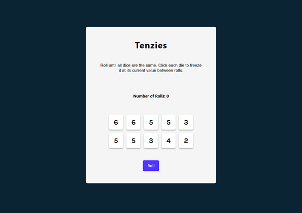
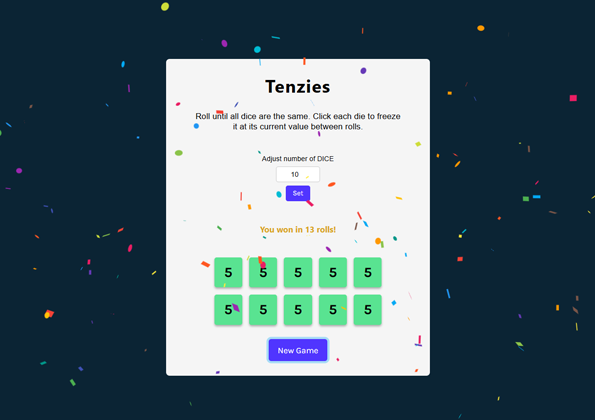

# Tenzies Game 🎲

**Tenzies** is a simple and interactive dice game built with React. The objective of the game is to roll dice untill all dice show the same value. You can freeze a die at its current value to keep it from rolling in subsequent attempts.

This project includes features like visual feedback for held dice (highlighted background), tracking the number of rolls, and a win condition that triggers confetti to celebrate your victory. After winning, the game allows players to adjust the number of dice for a more customized experience.

## Features 🚀

- **Interactive Dice Roll:** Roll up to 10 dice with random values between 1 and 6.
- **Hold Mechanism:** Click on dice to freeze their values to change background color.
- **Tracking mechanism:** Tracks the number of rolls to achieve victory.
- **Adjustable Dice count:** After winning, you can adjust the number of dice.
- **Winning Condition:** The game detects when all dice are held and have the same value.
- **Confetti Celebration:** A fun animation is displayed when you win.
- **Responsive Design:** The app works seamlessly across different devices.

## How to Play 🎮

1. Click the Roll button to roll all dice
2. Click on individual dice to freeze them at their current value.
3. Continue rolling until all dice displaye the same number.
4. Once you win, celebrate with confetti! Then, you can change (but don't have to) the number of dice and play again.

## Technologies Used 🛠️

- **React:** Frontend library for building user interfaces.
- **Nanoid:** To generate unique IDs for dice objects.
- **React-Confetti:** For the celebration effect when the game is won.
- **CSS:** To style the UI.

## Installation 📦

1. Clone this repository:
   `git clone https://github.com/your-username/tenzies-game.git`

2. Navigate into the project directory:
   `cd tenzies-game`

3. Install dependencies:
   `npm install`

4. Start the development server:
   `npm start`

5. Open the app in your browser at http://localhost:3000.

## Code Overview 🛠️

### Key Components

1. App Component

   - Manages game state using React's useState.
   - Generates and renders 10 dice objects.
   - Tracks whether the game has been won.

2. Die Component

   - Renders individual dice.
   - Accepts props for dice value, hold state, and a toggle function.
   - Provides visual feedback for held dice.

3. Key Functions
   - generateAllNewDice(): Generates an array of 10 dice objects, each with:
     - value: Random number between 1 and 6.
     - isHeld: Boolean to indicate hold status.
     - id: Unique identifier.
   - holdBackground(id): Toggles the isHeld property for the die with the given id.
   - rollDice():
     - Rolls new values for unheld dice.
     - Resets the game when all dice are held and have the same value.

## Screenshots 📸

Game Start

Game Won

## License 🛡️

This project is licensed under the MIT License. Feel free to use and modify the code for your own purposes.

## Acknowledgments 👏

    - [Scrimba](https://scrimba.com/)
    - [React](https://react.dev/)
    - [React-Confetti](https://www.npmjs.com/package/nanoid)
    - [Nanoid](https://www.npmjs.com/package/react-confetti)
